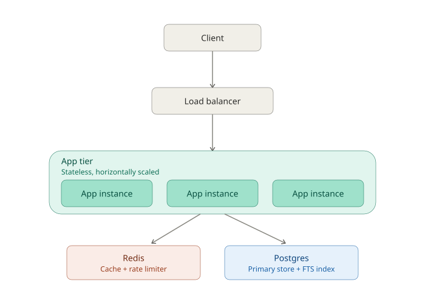
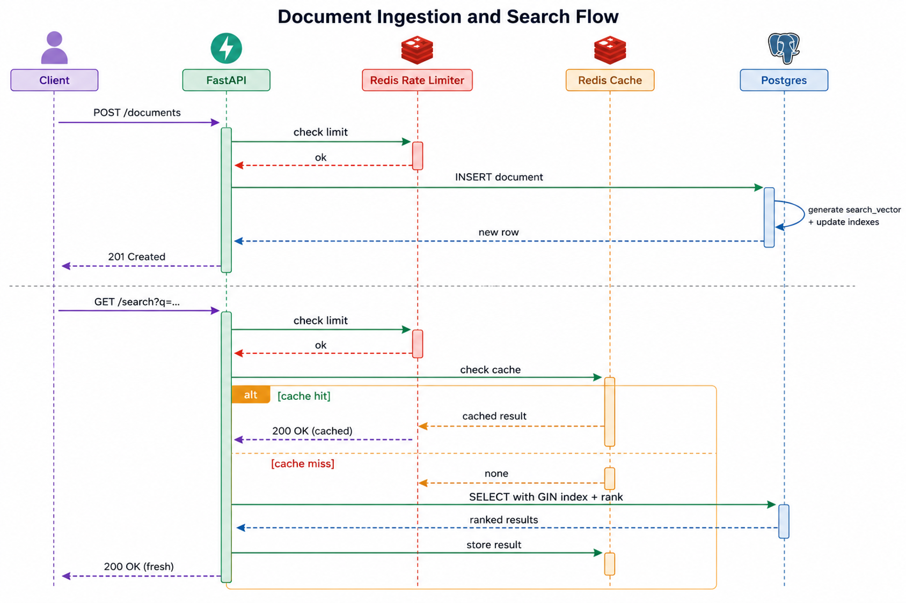
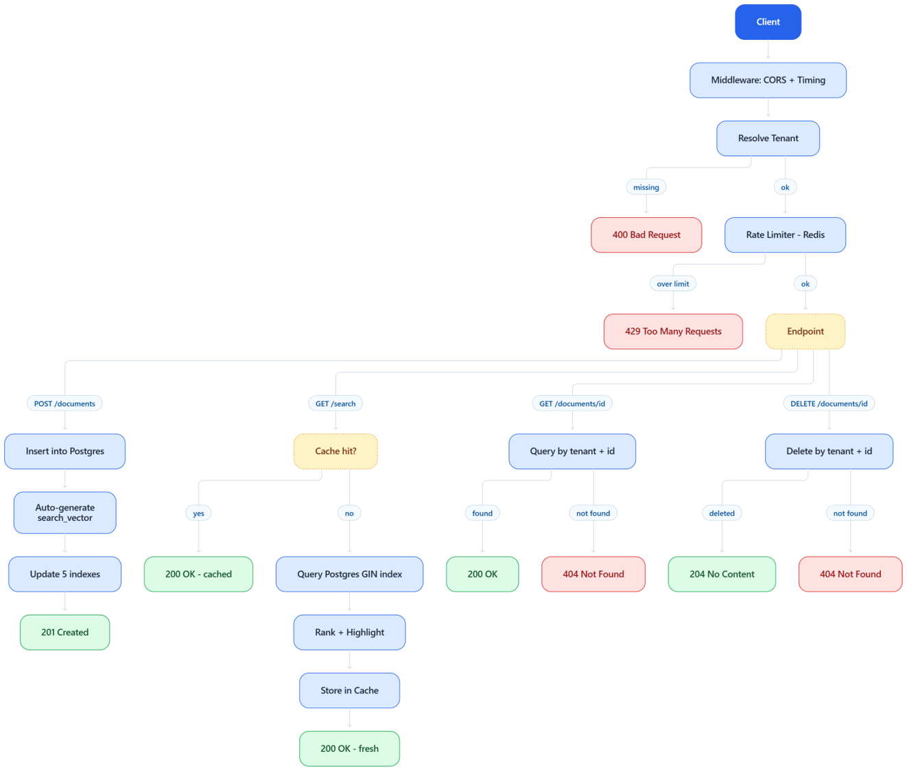
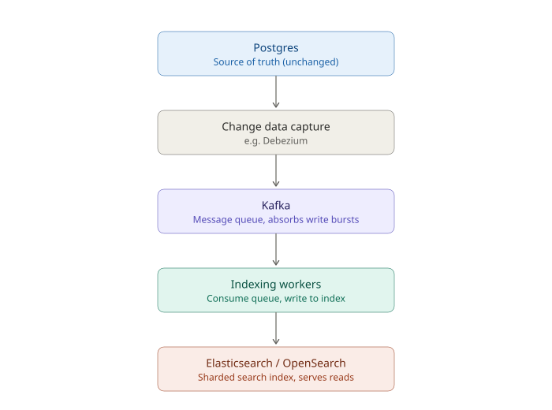
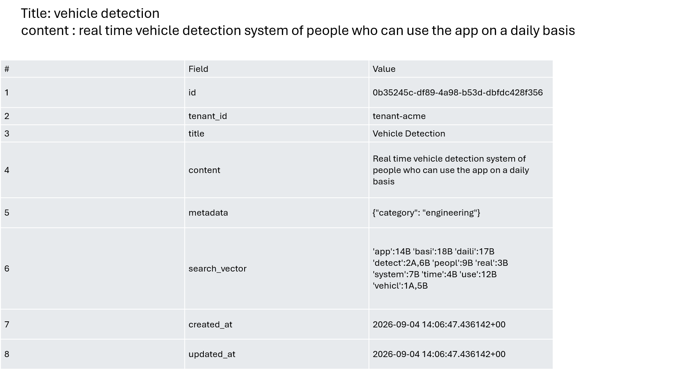
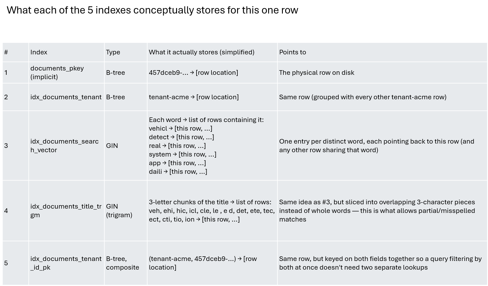

# Distributed Document Search Service — Technical Documentation

**Author:** _[Your Name]_
**Date:** _[Submission Date]_
**Repo:**  · **Live demo:** https://docsearch-35e7.onrender.com

---

## Table of Contents

1. [Architecture Design](#1-architecture-design)
   - 1.1–1.8 System design, storage, API, consistency, caching, message queue, multi-tenancy
   - [1.4.1 Database Schema & Indexing Strategy](#141-database-schema--indexing-strategy-worked-example)
   - [1.9 Operational Tooling](#19-operational-tooling-local--cloud)
2. [Production Readiness Analysis](#2-production-readiness-analysis)
3. [Enterprise Experience Showcase](#3-enterprise-experience-showcase)
4. [AI Tool Usage Note](#4-ai-tool-usage-note)

---

## 1. Architecture Design

### 1.1 High-Level System Architecture



**Component roles:**

| Component | Role |
|---|---|
| API Gateway / LB | TLS termination, routing, coarse-grained auth (JWT validation), tenant-header injection |
| App instances | Stateless FastAPI services — horizontally scaled behind the LB, no local state |
| Redis | Two jobs: (1) search-result cache, (2) per-tenant rate-limit counters |
| Postgres (primary + read replicas) | System of record + full-text search index (GIN over `tsvector`) |
| Message queue | Decouples document ingestion from indexing — absorbs write bursts, enables retry/backoff on failure |
| Indexing workers | Consume from queue, write to the search index, isolated failure domain from the write API |
| Object storage | Original document blobs (if documents are large files, not just text) — not needed for the text-only prototype but part of the realistic production picture |

### 1.2 Data Flow Diagrams

**Sequence diagram — indexing (write) and search (read) paths, showing every hop between Client, FastAPI, Redis, and Postgres:**



**Decision-flow diagram — all 4 endpoints, including every branch (rate-limit rejection, cache hit/miss, tenant-not-found):**



**Indexing (write) path — narrative:**

```
Client → POST /documents
   → API validates payload + tenant
   → App writes document row to Postgres (source of truth) — synchronous, gets an ID back immediately
   → App publishes an "index_document" event to the message queue (async)
   → 202/201 returned to client immediately (they don't wait for search-index propagation)
   → Indexing worker consumes event → computes tsvector (or pushes to Elasticsearch)
   → On failure: message retried with exponential backoff; after N attempts → dead-letter queue for manual/automated replay
```

*Note: the prototype simplifies this — Postgres's `GENERATED ALWAYS AS ... STORED` column computes the `tsvector` synchronously on insert, since Postgres FTS doesn't need a separate indexing pass. The async queue step above is the production design for when the search engine is a **separate system** (e.g. Elasticsearch) that must be kept in sync with the source-of-truth database — see 1.3 for that trade-off discussion.*

**Search (read) path — narrative:**

```
Client → GET /search?q=...&tenant=...
   → App checks Redis cache (key = hash(tenant_id, query, limit, offset))
   → Cache hit  → return cached results (few ms)
   → Cache miss → query Postgres GIN index, scoped to tenant_id
                → rank via ts_rank_cd, highlight via ts_headline
                → write result to Redis with short TTL
                → return to client
```

### 1.3 Storage Strategy: Search Engine, Database, Cache

**Search engine choice — Postgres FTS (prototype) vs. Elasticsearch (production-scale):**

| Criterion | PostgreSQL FTS | Elasticsearch |
|---|---|---|
| Operational overhead | None — same DB you already run | Separate cluster to operate, monitor, upgrade |
| Cost to run for a prototype/demo | $0 (free-tier Postgres) | No good permanent free tier |
| Relevance ranking sophistication | Good (`ts_rank_cd`, weighted fields) | Better (BM25, custom scoring, ML re-ranking) |
| Horizontal scalability of the index itself | Limited — scales with the DB (read replicas help reads, not write-side index sharding) | Native sharding across nodes, built for this |
| Faceted search / aggregations at scale | Workable via SQL `GROUP BY`, degrades at very large N | First-class, fast at scale |
| Fuzzy / typo-tolerant search | `pg_trgm` similarity — good enough for moderate scale | Native fuzzy matching, more tunable |
| Best fit | ≤ a few tens of millions of rows, team wants one less system | 10M+ docs, heavy query load, dedicated search team |

**Decision for this exercise:** Postgres FTS, because (a) the assignment's own volume target (10M+ documents) is within Postgres FTS's comfortable range if indexed and tuned correctly, (b) it lets the prototype run entirely on free-tier infrastructure with zero extra moving parts, and (c) it keeps the write path simpler (no dual-write consistency problem between DB and search index). **For a genuine 100M+ document, sub-100ms-p99, multi-region deployment, I would migrate the search index to Elasticsearch/OpenSearch** while keeping Postgres as the system of record — this is a well-trodden pattern (CDC from Postgres → Kafka → Elasticsearch indexer) and is discussed further in Section 2.



**Database:** PostgreSQL, chosen for ACID guarantees on the document metadata (source of truth), native JSONB for flexible per-tenant metadata without a rigid schema migration for every new field, and because it can serve both as the OLTP store and (via GIN indexes) the search index in one system for this scale.

**Cache layers:**
1. **Application-level search-result cache (Redis)** — cache-aside, tenant-scoped keys, 30s TTL. Short TTL chosen deliberately: freshness matters more than hit-rate for a search product where users expect their own just-indexed documents to show up quickly.
2. **Postgres buffer cache / OS page cache** — free performance from Postgres itself once the hot working set (recent tenants' data) fits in memory.
3. *(Production addition)* **CDN edge cache** for `GET /documents/{id}` on read-heavy, rarely-changing documents.

### 1.4 API Design

| Method | Path | Purpose |
|---|---|---|
| `POST` | `/documents` | Index a new document |
| `GET` | `/search?q={query}&tenant={tenantId}&limit=&offset=` | Full-text search, ranked |
| `GET` | `/documents/{id}` | Retrieve a single document |
| `DELETE` | `/documents/{id}` | Remove a document |
| `GET` | `/health` | Liveness + dependency status |

**Tenant identification:** `X-Tenant-ID` header (preferred — mirrors a production topology where an API gateway injects this from a validated JWT claim) or `tenant` query param (per the assignment's example contract). Header takes precedence if both are present.

**Example — index a document:**
```http
POST /documents
X-Tenant-ID: tenant-acme
Content-Type: application/json

{
  "title": "Q3 Financial Report",
  "content": "Revenue grew 12% quarter over quarter...",
  "metadata": {"category": "finance", "author": "jane.doe"}
}
```
```json
201 Created
{
  "id": "311a6b28-9fd6-4678-b9c3-eec7209417fb",
  "tenant_id": "tenant-acme",
  "title": "Q3 Financial Report",
  "content": "Revenue grew 12% quarter over quarter...",
  "metadata": {"category": "finance", "author": "jane.doe"},
  "created_at": "2026-09-01T02:13:10.610212Z",
  "updated_at": "2026-09-01T02:13:10.610212Z"
}
```

**Example — search:**
```http
GET /search?q=quarterly%20revenue&limit=10
X-Tenant-ID: tenant-acme
```
```json
200 OK
{
  "query": "quarterly revenue",
  "tenant_id": "tenant-acme",
  "total_results": 1,
  "limit": 10,
  "offset": 0,
  "took_ms": 4.9,
  "cached": false,
  "results": [
    {
      "id": "311a6b28-...",
      "title": "Q3 Financial Report",
      "snippet": "<mark>Revenue</mark> grew 12% <mark>quarter</mark> over <mark>quarter</mark>...",
      "score": 0.108,
      "metadata": {"category": "finance"},
      "created_at": "2026-09-01T02:13:10.610212Z"
    }
  ]
}
```

**Error contract (consistent shape across all endpoints):**
```json
{ "error": "internal_server_error", "detail": "human-readable message" }
```

Full interactive contract is also auto-generated at `/docs` (Swagger UI) and `/openapi.json` by FastAPI.

### 1.4.1 Database Schema & Indexing Strategy (Worked Example)

The `documents` table has **8 fields**. Three of them — `title`, `content`, `metadata` — hold the client's actual submitted data unmodified. A fourth, `search_vector`, is auto-generated by Postgres from `title`+`content` purely to enable search, weighting title matches higher than body matches. On top of all this, there are **5 indexes**: 1 implicit (the primary key's uniqueness index, which Postgres creates automatically) and 4 explicit ones added deliberately — a GIN index on `search_vector` for full-text search, a trigram GIN index on `title` for fuzzy matching, a general tenant index, and a composite tenant+id index matching the exact query pattern of the single-document endpoints.

**Worked example** — indexing a document with `title: "Vehicle Detection"` and `content: "Real time vehicle detection system of people who can use the app on a daily basis"`, then inspecting the resulting row directly in Postgres:



Notice `search_vector` is not a copy of your text — it's a stemmed, stop-word-filtered, weighted token list (`'vehicl':1A,5B` means "vehicle" appears at position 1 in the *title* (weight A) and position 5 in the *content* (weight B), merged into one entry). This is what actually gets indexed, not the raw `title`/`content` strings.

**What each of the 5 indexes conceptually stores** for this same row:



The practical distinction: **B-tree indexes** (rows 1, 2, 5 in the table above) store one entry per whole value — good for exact lookups like "find this id" or "find this tenant." **GIN indexes** (rows 3, 4) store one entry per *fragment* of a value — one entry per word for full-text search, one entry per 3-character chunk for fuzzy trigram matching — because text needs to be broken into searchable pieces first, while a UUID or tenant string doesn't.

### 1.5 Consistency Model and Trade-offs


- **Within the write path (document CRUD):** strongly consistent — Postgres transactions guarantee a `POST` is immediately visible to a subsequent `GET /documents/{id}`.
- **Within the search path:** **eventually consistent by design**, for two independent reasons:
  1. The Redis search-result cache can serve up-to-30-seconds-stale results.
  2. In the production architecture with a separate search engine (Elasticsearch), there's an inherent propagation delay between "document written to Postgres" and "document searchable" while the async indexer catches up.
- **Trade-off accepted:** search is read-heavy and tolerant of a few seconds of staleness (nobody expects a search index to be a real-time mirror), so we trade strict consistency for throughput and horizontal scalability on the read path. This is the same trade-off made by virtually every production search system (Google, Elasticsearch itself, Algolia).
- **Where we do NOT relax consistency:** tenant isolation. Every query — cached or not — is scoped by `tenant_id` at the query level, never only at the cache-key level, so a cache bug can't leak another tenant's data.

### 1.6 Caching Strategy (Summary)

| Layer | What's cached | TTL / invalidation | Why |
|---|---|---|---|
| Redis — search results | Full search response per (tenant, query, limit, offset) | 30s TTL, no active invalidation | Simplicity; avoids tracking "which cached queries does this write affect" |
| Redis — rate-limit counters | Per-tenant request count in current window | Auto-expires at window end | O(1) fixed-window limiter |
| Postgres buffer cache | Hot table/index pages | LRU, automatic | Free win from the DB engine |
| *(Production)* CDN | Individual document GETs | Cache-Control headers, purge on delete/update | Offloads read traffic from the API entirely |

### 1.7 Message Queue Usage

Not present in the prototype (Postgres FTS's synchronous generated column makes it unnecessary at this scale), but designed into the production architecture for two purposes:

1. **Decoupling ingestion from indexing** when the search index is a separate system (Elasticsearch): write path publishes an event, indexing workers consume it, so a slow or temporarily-down search cluster never blocks document writes.
2. **Absorbing burst traffic**: a customer bulk-uploading 500K documents shouldn't be able to overwhelm the indexing pipeline or degrade search latency for other tenants — the queue acts as a buffer, and workers scale independently based on queue depth.

**Choice:** Kafka for high-throughput multi-consumer scenarios (replay, multiple indexers, analytics consumers off the same stream) or SQS for simplicity if a single consumer group and managed infra is preferred. Given the "10M+ documents, multi-tenant" scale in the brief, Kafka's replay capability and partition-per-tenant-shard potential make it the stronger long-term choice.

### 1.8 Multi-Tenancy Approach and Data Isolation

**Model chosen: shared database, shared schema, tenant_id column** (aka "pool" model), not schema-per-tenant or database-per-tenant.

| Isolation model | Isolation strength | Operational cost at 1000s of tenants | Chosen? |
|---|---|---|---|
| Database-per-tenant | Strongest | Very high — migrations, backups, connections all multiply | No |
| Schema-per-tenant | Strong | High — same migration multiplication problem, worse connection pooling | No |
| **Shared table + `tenant_id` column** | Good, if enforced everywhere | Low — one schema, one migration path, pooled connections | **Yes** |

**Why:** at "10M+ documents across multiple tenants" scale, the pooled model is what virtually every multi-tenant SaaS search product uses (it's how Elasticsearch/Algolia-backed SaaS products model tenants too — as a filter field, not a separate cluster). It keeps operational cost flat as tenant count grows.

**Enforcement layers (defense in depth):**
1. **Application layer** (implemented in prototype): every repository method takes `tenant_id` and includes it in the `WHERE` clause — there is no code path that queries `documents` without a tenant filter.
2. **Database layer** (production addition, not in prototype): Postgres **Row-Level Security (RLS)** policies as a second, independent enforcement point — so even a future code bug that forgets the `WHERE tenant_id = ...` clause still can't leak data, because Postgres itself rejects the unscoped query.
3. **Index layer**: `tenant_id` is the leading column in the composite `(tenant_id, id)` index, so tenant-scoped queries are always fast, never full-table scans.
4. **Rate limiting**: per-tenant, so one noisy tenant can't degrade the shared infrastructure for others (implemented in prototype via Redis).

### 1.9 Operational Tooling (Local & Cloud)

Beyond the API itself, the project includes tooling for validating and demonstrating the system without requiring a separate frontend build:

- **Visual search console** (`/ui`, served directly by the FastAPI app from `app/static/search-ui.html`) — lets anyone index documents and run live, highlighted searches from a browser, locally or against the deployed instance, with no separate install or file to open manually.
- **Adminer** (local only, via `docker-compose.yml`) — a lightweight Postgres web UI for browsing the raw `documents` table, useful for demonstrating the `tenant_id` column and the generated `search_vector` column directly. **Deliberately not deployed to the cloud environment** — exposing a database login page on a public URL is unnecessary risk for a demo; the equivalent capability in production is Neon's own built-in SQL Editor, reached through an authenticated console login rather than an open port.
- **Seed & benchmark script** (`scripts/seed_and_benchmark.py`) — generates realistic sample documents and measures real p50/p95/p99 search latency (see §2.5 for results from an actual run).

---

## 2. Production Readiness Analysis

### 2.1 Scalability — handling 100x growth (1B+ documents, 100K+ req/s)

- **Database:** move from a single Postgres instance to (a) **read replicas** for search traffic (search is read-heavy — route `GET /search` to replicas, keep writes on primary), (b) **partitioning** the `documents` table by `tenant_id` hash or by time, so any single index/vacuum operation touches a bounded slice of data, (c) at genuine 100M+ scale, migrate the search index off Postgres entirely to **Elasticsearch/OpenSearch** with tenant-aware sharding (route by tenant_id hash to a shard), keeping Postgres as the source-of-truth metadata store behind a CDC pipeline (Debezium → Kafka → ES indexer).
- **App tier:** already stateless — scale by adding more container replicas behind the load balancer (Kubernetes HPA on CPU/request-latency, or equivalent autoscaling group). No code changes needed; this is the entire point of the stateless design.
- **Cache:** move from single-node Redis to **Redis Cluster** (sharded) once cache traffic outgrows one node's memory/throughput.
- **Rate limiter:** the current fixed-window Redis counter scales fine even at 100x since it's O(1) per request — no changes needed structurally, just ensure the Redis cluster backing it is itself scaled.

### 2.2 Resilience — circuit breakers, retries, failover

- **Circuit breakers** between the app and both Postgres and the search cluster: if Elasticsearch (production) starts timing out, trip the breaker and serve degraded results (e.g., cached-only, or Postgres-FTS-as-fallback) rather than cascading the failure into request pile-up and thread/connection exhaustion.
- **Retry strategy:** exponential backoff with jitter for transient failures (connection resets, brief network partitions), capped retry count, and importantly — **retries must be idempotent-safe**. `DELETE` and `GET` are naturally idempotent; `POST /documents` should accept an optional client-supplied idempotency key to make retried indexing calls safe.
- **Failover:** Postgres primary failure → automated promotion of a standby replica (e.g., via Patroni or a managed provider's built-in failover — this is exactly why we'd choose a managed Postgres in production rather than self-hosting). Redis failure → the rate limiter and cache are both designed to **fail open** (already implemented in the prototype: if Redis errors, rate limiting is skipped and cache is bypassed rather than the request failing) — a deliberate choice that trades perfect enforcement for availability of the core search function.
- **Bulkheads:** isolate the indexing worker pool from the query-serving app pool so a burst of writes can't starve read capacity.

### 2.3 Security

- **AuthN/AuthZ:** JWT-based auth validated at the API gateway; the JWT's tenant claim becomes the trusted source for `X-Tenant-ID` (in the prototype the header is trusted directly for simplicity — in production it must be derived from a verified token, never accepted as a raw client-supplied header, or any client could claim to be any tenant).
- **Encryption in transit:** TLS everywhere (client→gateway, gateway→app, app→Postgres/Redis using `sslmode=require` and Redis TLS).
- **Encryption at rest:** managed Postgres/Redis providers offer this by default (e.g., Supabase, RDS, ElastiCache); enable it explicitly rather than assuming defaults.
- **API security:** input validation (already done via Pydantic schemas), request size limits (prevent giant payload DoS), per-tenant rate limiting (implemented), WAF at the edge for common injection/XSS patterns, and secrets (DB/Redis credentials) in a secrets manager (not env files) in production.
- **Tenant isolation as a security boundary**, not just a data-modeling choice — see Section 1.8's defense-in-depth layers, especially RLS as the production hardening step beyond what the prototype does at the application layer alone.

### 2.4 Observability

- **Metrics:** RED metrics per endpoint (Rate, Errors, Duration) exported in Prometheus format; key custom metrics: search latency p50/p95/p99 (already measured in the benchmark script), cache hit rate, per-tenant request volume, rate-limit rejection rate.
- **Logging:** structured JSON logs (not the plain console logs the prototype uses), with `tenant_id` and a `request_id` on every log line for traceable debugging, shipped to a centralized system (e.g., Loki, CloudWatch Logs, ELK).
- **Distributed tracing:** OpenTelemetry instrumentation across the app → Postgres/Redis/queue call graph, so a single slow search request can be traced end-to-end (which layer added the latency: cache miss? slow query? network?). This directly extends the `X-Process-Time-Ms` header already emitted by the prototype's middleware into a full trace span.
- **Alerting:** SLO-based alerts (e.g., "p95 search latency > 500ms for 5 minutes") rather than naive threshold-per-metric alerts, to reduce noise and tie alerts directly to user-facing impact.

### 2.5 Performance — DB optimization, index management, query optimization

- **Index management:** the prototype's GIN index on `search_vector` is the single most important index; monitor index bloat and run `REINDEX CONCURRENTLY` periodically at scale. Partial indexes per common filter (e.g., per `metadata->category`) can help specific hot query patterns.
- **Query optimization:** the benchmark run during development surfaced a concrete finding worth highlighting — **connection pool sizing directly bounded p95/p99 latency under concurrent load** (p95 dropped from ~1.4s to ~0.21s once concurrency was sized to the connection pool rather than exceeding it). At 100x scale this generalizes to: pool sizing, PgBouncer (connection pooling proxy) in front of Postgres, and `EXPLAIN ANALYZE`-driven query tuning are not optional — they are the difference between meeting and missing the 500ms p95 SLA.
- **Database optimization:** vacuum/analyze tuning for write-heavy tables, appropriate `shared_buffers`/`work_mem` sizing, and read replicas to separate search-read load from write load.
- **Future enhancement — hybrid semantic search:** the current search is purely lexical (keyword/stem matching via `search_vector`), which won't surface conceptually related results that don't share exact word stems (e.g. searching "car" won't match a document that only says "vehicle"). A natural next step is **hybrid search**: add a `pgvector` column storing an embedding of each document, generate a query embedding at search time, and merge lexical (`ts_rank_cd`) and semantic (cosine-distance) scores into one ranked result set. This stays entirely within the existing Postgres instance (no new database), adds one embedding-API call per write and per search, and is a well-established production pattern rather than a speculative one. I evaluated bringing in a dedicated vector database (Chroma/Pinecone) and an LLM-orchestration framework (LangChain/LangGraph) for this, and deliberately chose not to — those tools solve multi-step *agentic* problems (chained reasoning, tool-calling) that don't exist in a search API with no generation step, and Chroma's single-node design and Pinecone's free-tier limits both work against this project's 10M-document, free-tier-deployable requirements. `pgvector` was the right-sized choice; the heavier stack would have been complexity without a matching problem.

### 2.6 Operations — deployment, zero-downtime, backup/recovery

- **Deployment strategy:** blue-green or rolling deployment behind the load balancer — new version's containers pass health checks (the `/health` endpoint, already implemented, is exactly what a deployment orchestrator polls) before traffic shifts, old version stays up until the new one is confirmed healthy, enabling instant rollback.
- **Zero-downtime schema changes:** additive-only migrations in the deploy path (add nullable columns, backfill asynchronously, only make `NOT NULL` in a later release) — never a blocking `ALTER TABLE` on a large table during a deploy window.
- **Backup/recovery:** automated daily Postgres snapshots + continuous WAL archiving for point-in-time recovery; regular restore drills (a backup nobody has tested restoring is not a real backup).

### 2.7 SLA Considerations — achieving 99.95% availability

99.95% availability ≈ **~4.4 hours of downtime allowed per year** (~21.6 minutes/month). To hit this:
- No single point of failure: multi-AZ Postgres with automated failover, multiple app replicas across AZs, Redis with replica failover.
- Health-check-gated deployments (Section 2.6) so bad deploys never count against the SLA window.
- Circuit breakers + fail-open cache/rate-limiter (Section 2.2) so a *dependency's* outage degrades gracefully rather than taking the whole API down — this is why the health endpoint distinguishes `degraded` (Redis down, core search still works) from `unhealthy` (Postgres down, cannot serve).
- Load testing before scale events (product launches, known traffic spikes) rather than discovering capacity limits in production.

---

## 3. Enterprise Experience Showcase

> **This section must be written by you.** I've built the strongest possible prototype and analysis I can, but your actual work history, incidents, and decisions are yours to describe — an interviewer will (rightly) probe for specifics I can't invent on your behalf. Use the prompts below; each answer only needs to be the 1-2 paragraphs the brief asks for.

### 3.1 A similar distributed system you've built
*Prompt: What was the system? What scale (documents, requests/sec, data volume, team size)? What was the business impact? What architectural choices mirrored (or differed from) what's above?*

_[Your answer here]_

### 3.2 A performance optimization with significant impact
*Prompt: What was slow, how did you find it (profiling? monitoring alert? customer complaint?), what did you change, and what was the measured before/after improvement? Numbers are persuasive here — even approximate ones.*

_[Your answer here]_

### 3.3 A critical production incident you resolved
*Prompt: What broke, how did you detect it, what was the immediate mitigation vs. the root-cause fix, and what changed afterward (postmortem action items, new alerting, architectural change) so it couldn't recur the same way?*

_[Your answer here]_

### 3.4 An architectural decision balancing competing concerns
*Prompt: What were the two (or more) things in tension (e.g., consistency vs. availability, cost vs. latency, speed-to-ship vs. long-term maintainability)? What did you choose, why, and what was the trade-off you consciously accepted?*

_[Your answer here]_

---

## 4. AI Tool Usage Note

This prototype and documentation were developed with Claude (Anthropic) as an AI pair-programming assistant, per the assignment's explicit encouragement to use AI tools. Specifics:

- **Code generation:** the FastAPI application structure, Postgres schema (including the generated `tsvector` column and GIN/trigram indexes), Redis-backed caching and rate-limiting logic, and Docker Compose setup were drafted with Claude and then **run and verified end-to-end** in a live sandbox — not just generated and assumed correct. This included catching and fixing a real bug (asyncpg returning JSONB columns as raw strings rather than parsed dicts, which broke document creation) through an actual test-and-fix cycle.
- **Visual tooling:** the `/ui` search console and the architecture diagrams embedded in this document (§1.1, §1.3) were built with Claude; the diagrams specifically were rendered to images and visually inspected for overlap/layout errors before being committed, not accepted sight-unseen.
- **Benchmarking:** the seed/benchmark script was written with Claude, then executed against the running service to produce the real latency figures cited in Section 2.5 (including the connection-pool-sizing finding) — these are measured numbers from an actual run, not estimates.
- **Deployment:** the free-tier cloud deployment (Neon, Upstash, Render) was completed interactively with Claude across account creation, credential handling, a Windows Docker Desktop/WSL2 startup issue, Git/GitHub setup, and Render's service configuration — with Claude reading actual terminal output, error messages, and dashboard screenshots at each step. The `deploy/deploy.sh` automation script was also written with Claude, but its cloud-provisioning API calls could not be executed inside Claude's own sandbox (network-restricted to package registries), so the live deployment was ultimately completed via each provider's manual dashboard flow instead, with the script kept in the repo as a documented, not-yet-independently-verified alternative path.
- **Documentation:** this document's structure and first drafts were produced with Claude, then revised over the course of the project as components were added (the `/ui` console, Adminer, deployment tooling, diagrams), and should be further edited by you to reflect your own voice and — critically — your own real experience in Section 3, which Claude did not and should not fabricate.
- **What I (the candidate) did:** _[Describe your own review, edits, and any manual changes/testing you did beyond what's above — be specific and honest, since this section is itself part of what's being evaluated.]_
